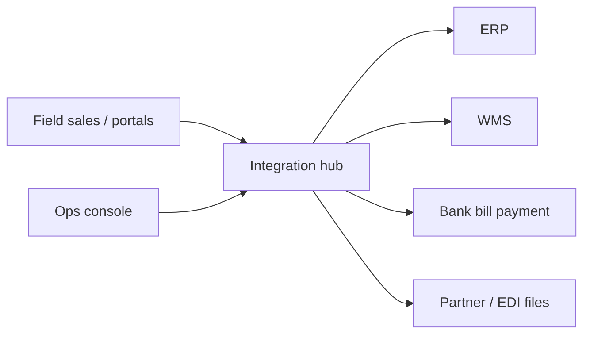

# Piyawut Boonpeng

**Senior Programmer · Full Stack (Laravel / React) · Enterprise integration**  
Bangkok, Thailand · Open to full-time roles · Available within 30 days

[For recruiters](FOR_RECRUITERS.md) · [Paste this on job sites](FOR_JOB_SITES.md) · [ไทย](#สำหรับผู้สรรหาภาษาไทย) · [Legal](LEGAL.md)

**Attach this URL on LinkedIn, JobThai, JobBKK, JobsDB, and email:**  
https://github.com/piyawut-portfolio/piyawut-portfolio

---

I design and ship the **integration layer** between sales, warehouse, finance, banks, and retail partners — not only CRUD screens.

12 years in IT: manufacturing ERP (PowerBuilder / Oracle), then 5 years as Senior Programmer at **Saha Pathanapibul PCL** building REST APIs, ERP/WMS sync, bank bill payment, EDI, and a React operations console.

This repository is a **public case-study portfolio**. It does **not** contain employer source code, secrets, or production data.

## Snapshot

| | |
|---|---|
| **Target roles** | Senior Full Stack · Senior Backend · Senior Programmer |
| **Backend** | PHP, Laravel 5.2 / 8 / 13, REST, OpenAPI, Sanctum, queues |
| **Frontend** | React 19, TypeScript, Vite, TanStack Query |
| **Data** | Oracle, MySQL, SQL, schema design |
| **Integration** | ERP (NetSuite / Odoo), WMS, bank H2H / QR, EDI, marketplaces |
| **Delivery** | Docker, GitLab CI, RBAC, audit, prompt-assisted engineering with human review |

## Selected work

| Case | Problem | What I delivered |
|------|---------|------------------|
| [01 · Integration hub](case-studies/01-integration-hub.md) | Sales, ERP, warehouse, and partner files were disconnected | Laravel 13 hub: 70+ documented APIs, overnight ERP sync, EDI and supplier stock jobs, Docker CI |
| [02 · Ops console](case-studies/02-ops-console.md) | Ops needed CLI/DB access to run jobs | React 19 + Laravel 13 BFF with project RBAC, force-sync and operational UIs |
| [03 · Banking & finance APIs](case-studies/03-bank-payment.md) | Bank payments did not post cleanly into AR | Host-to-host inquiry/confirm, Thai QR pay-in slips, e-WHT, PDPA |
| [04 · Long-lived API hub](case-studies/04-legacy-api-hub.md) | Many clients on old API versions | Versioned Laravel 5.2 APIs; Oracle / Odoo / WMS / marketplace bridges without breaking production |
| [05 · Plant ERP](case-studies/05-manufacturing-erp.md) | Factory processes needed software + specs | PowerBuilder / Oracle ERP (FIFO, PO, BOM, MRP); later System Analyst (SRS, flows) |

## How to read this repo

Hiring managers: start with the table above, then open one case that matches the job (API, fullstack, or payments). One-page snapshot: [FOR_RECRUITERS.md](FOR_RECRUITERS.md).

Job boards: copy-paste blocks are in [FOR_JOB_SITES.md](FOR_JOB_SITES.md). Do not attach a `.zip` of company projects.

## Architecture (illustrative)

Names below are generic. They are **not** internal hostnames.

## What you will not find here

Employer Git repos, `.env`, keys, certificates, database dumps, real EDI/bank payloads, internal URLs, or customer data.

Personal demo apps (rewritten from scratch, fake domain) are described in [demos/README.md](demos/README.md).

---

## สำหรับผู้สรรหาภาษาไทย

วิศวกรอาวุโส ประสบการณ์ 12 ปี ทำชั้นเชื่อมระบบองค์กรที่ บมจ. สหพัฒนพิบูล: Laravel, React, Oracle, ธนาคาร, EDI, WMS

Repo นี้เป็น **เคสศึกษา** ไม่ใช่ซอร์สโค้ดบริษัท — ใช้แนบใบสมัครและ LinkedIn ได้โดยไม่ละเมิดทรัพย์สินนายจ้าง

อ่านเคส: [01](case-studies/01-integration-hub.md) · [02](case-studies/02-ops-console.md) · [03](case-studies/03-bank-payment.md) · [04](case-studies/04-legacy-api-hub.md) · [05](case-studies/05-manufacturing-erp.md)

คัดลอกข้อความไปเว็บหางาน: [FOR_JOB_SITES.md](FOR_JOB_SITES.md)
